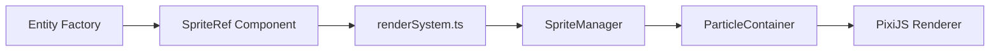

# Ship and Enemy UI Upgrade Plan

Deep analysis of the codebase to upgrade visual complexity for ships and turrets with complex geometry and rotation support.

---

## Current Architecture Analysis

### Rendering Pipeline


### Current Limitations

| Component | Current State | Limitation |
|-----------|--------------|------------|
| [textures.ts](file:///Users/chayut/repos/kobayashi-maru/src/rendering/textures.ts) | 16px simple shapes (circle, triangle, square) | Too simple, no detail |
| [spriteManager.ts](file:///Users/chayut/repos/kobayashi-maru/src/rendering/spriteManager.ts) | `ParticleContainer` with position-only | **Rotation disabled** |
| [components.ts](file:///Users/chayut/repos/kobayashi-maru/src/ecs/components.ts) | No `Rotation` component | Entities can't rotate |
| [renderSystem.ts](file:///Users/chayut/repos/kobayashi-maru/src/systems/renderSystem.ts) | Updates x,y position only | No rotation sync |

### Entity Types Requiring Visual Upgrade

#### Turrets (3 types)
- **Phaser Array** → hexagon texture
- **Torpedo Launcher** → octagon texture  
- **Disruptor Bank** → pentagon texture

#### Enemy Factions (5 types)
- **Klingon** → triangle (Bird of Prey)
- **Romulan** → crescent arc (Warbird)
- **Borg** → square (Cube)
- **Tholian** → diamond
- **Species 8472** → Y-shape (Bioship)

---

## Proposed Architecture Changes

### Phase 1: Add Rotation Support

> [!IMPORTANT]
> This is a **foundational change** that enables turnable sprites. All subsequent phases depend on this.

#### [NEW] Rotation Component
Add to [components.ts](file:///Users/chayut/repos/kobayashi-maru/src/ecs/components.ts):
```typescript
export const Rotation = defineComponent({
  angle: Types.f32  // Radians
});
```

#### [MODIFY] SpriteManager - Enable Rotation
Update [spriteManager.ts](file:///Users/chayut/repos/kobayashi-maru/src/rendering/spriteManager.ts):
```diff
 const container = new ParticleContainer({
   dynamicProperties: {
     position: true,
-    scale: false,
-    rotation: false,
+    scale: true,
+    rotation: true,
     color: false
   }
 });
```

Add new method:
```typescript
updateSpriteRotation(index: number, rotation: number): void {
  const entry = this.particles.get(index);
  if (entry) {
    entry.particle.rotation = rotation;
  }
}
```

#### [MODIFY] Render System - Sync Rotation
Update [renderSystem.ts](file:///Users/chayut/repos/kobayashi-maru/src/systems/renderSystem.ts):
```typescript
// After updating position, also update rotation
if (hasComponent(world, Rotation, eid)) {
  spriteManager.updateSpriteRotation(spriteIndex, Rotation.angle[eid]);
}
```

---

### Phase 2: Enhanced Texture Generation

> [!TIP]
> Complex geometry can be achieved with programmatic drawing—no asset files needed.

#### [MODIFY] textures.ts - Larger, Detailed Shapes
Upgrade [textures.ts](file:///Users/chayut/repos/kobayashi-maru/src/rendering/textures.ts):

| Entity | Current | Proposed |
|--------|---------|----------|
| Ship size | 16px | 32-48px |
| Turret size | 16px | 24-32px |
| Detail | Solid fill | Multi-layer with glow/outline |

#### Enemy Craft Texture Designs

All enemy crafts upgraded from 16px simple shapes to 32px detailed designs with multi-layer rendering.

---

**1. Klingon Bird of Prey** (Aggressive, fast)
```typescript
function createKlingonTexture(app: Application, color: number): RenderTexture {
  const graphics = new Graphics();
  const size = 32;
  
  // Main hull - swept-wing bird shape
  graphics.poly([
    size/2, 2,           // Nose (forward point)
    size - 4, size/2,    // Right wingtip
    size/2 + 4, size/2 + 6, // Right wing joint
    size/2, size - 4,    // Tail
    size/2 - 4, size/2 + 6, // Left wing joint
    4, size/2            // Left wingtip
  ]);
  graphics.fill({ color });
  
  // Wing struts
  graphics.moveTo(size/2, size/3);
  graphics.lineTo(size - 6, size/2 - 2);
  graphics.moveTo(size/2, size/3);
  graphics.lineTo(6, size/2 - 2);
  graphics.stroke({ color: 0xFFFFFF, alpha: 0.3, width: 1 });
  
  // Bridge (center cockpit)
  graphics.circle(size/2, size/3, 3);
  graphics.fill({ color: 0x882222 });
  
  // Dual engine glow
  graphics.circle(size/2 - 4, size - 6, 2);
  graphics.circle(size/2 + 4, size - 6, 2);
  graphics.fill({ color: 0xFF4444, alpha: 0.8 });
  
  return renderToTexture(app, graphics, size);
}
```

---

**2. Romulan Warbird** (Stealthy, flanking behavior)
```typescript
function createRomulanTexture(app: Application, color: number): RenderTexture {
  const graphics = new Graphics();
  const size = 32;
  
  // Main hull - crescent/bird shape with swept wings
  graphics.poly([
    size/2, 4,             // Nose
    size - 3, size/3,      // Right wing forward
    size - 5, size/2 + 4,  // Right wing back
    size/2, size/2,        // Center notch
    5, size/2 + 4,         // Left wing back
    3, size/3              // Left wing forward
  ]);
  graphics.fill({ color });
  
  // Wing feather details
  graphics.moveTo(size/2, size/4);
  graphics.lineTo(size - 8, size/3 + 2);
  graphics.moveTo(size/2, size/4);
  graphics.lineTo(8, size/3 + 2);
  graphics.stroke({ color: 0xFFFFFF, alpha: 0.2, width: 1 });
  
  // Cloaking device glow (center)
  graphics.circle(size/2, size/3, 4);
  graphics.fill({ color: 0x66CC33, alpha: 0.6 });
  
  // Singularity core (engine)
  graphics.arc(size/2, size/2 + 2, 6, 0, Math.PI);
  graphics.stroke({ color: 0x99FF66, alpha: 0.8, width: 2 });
  
  return renderToTexture(app, graphics, size);
}
```

---

**3. Borg Cube** (Slow, tanky swarm)
```typescript
function createBorgTexture(app: Application, color: number): RenderTexture {
  const graphics = new Graphics();
  const size = 32;
  
  // Main cube body
  graphics.rect(4, 4, size - 8, size - 8);
  graphics.fill({ color });
  
  // Grid pattern (Borg aesthetic)
  for (let i = 0; i < 3; i++) {
    graphics.moveTo(8 + i * 6, 4);
    graphics.lineTo(8 + i * 6, size - 4);
    graphics.moveTo(4, 8 + i * 6);
    graphics.lineTo(size - 4, 8 + i * 6);
  }
  graphics.stroke({ color: 0x000000, alpha: 0.5, width: 1 });
  
  // Corner energy nodes
  graphics.circle(6, 6, 2);
  graphics.circle(size - 6, 6, 2);
  graphics.circle(6, size - 6, 2);
  graphics.circle(size - 6, size - 6, 2);
  graphics.fill({ color: 0x44FF44, alpha: 0.9 });
  
  // Central core
  graphics.circle(size/2, size/2, 4);
  graphics.fill({ color: 0x00FF00, alpha: 0.7 });
  
  return renderToTexture(app, graphics, size);
}
```

---

**4. Tholian Vessel** (Orbiting, ranged attacker)
```typescript
function createTholianTexture(app: Application, color: number): RenderTexture {
  const graphics = new Graphics();
  const size = 32;
  
  // Main body - elongated diamond/crystal shape
  graphics.poly([
    size/2, 2,             // Top point
    size - 4, size/2 - 4,  // Right upper
    size - 2, size/2,      // Right mid
    size - 4, size/2 + 4,  // Right lower
    size/2, size - 2,      // Bottom point
    4, size/2 + 4,         // Left lower
    2, size/2,             // Left mid
    4, size/2 - 4          // Left upper
  ]);
  graphics.fill({ color });
  
  // Crystal facets
  graphics.moveTo(size/2, 2);
  graphics.lineTo(size/2, size - 2);
  graphics.moveTo(4, size/2 - 4);
  graphics.lineTo(size - 4, size/2 + 4);
  graphics.moveTo(4, size/2 + 4);
  graphics.lineTo(size - 4, size/2 - 4);
  graphics.stroke({ color: 0xFFAA33, alpha: 0.5, width: 1 });
  
  // Core heat glow
  graphics.circle(size/2, size/2, 5);
  graphics.fill({ color: 0xFFDD00, alpha: 0.6 });
  
  // Web emitter tips
  graphics.circle(size/2, 4, 2);
  graphics.circle(size/2, size - 4, 2);
  graphics.fill({ color: 0xFF8800, alpha: 0.9 });
  
  return renderToTexture(app, graphics, size);
}
```

---

**5. Species 8472 Bioship** (Aggressive hunter)
```typescript
function createSpecies8472Texture(app: Application, color: number): RenderTexture {
  const graphics = new Graphics();
  const size = 32;
  
  // Organic Y-shaped hull
  // Main body (curved organic shape)
  graphics.moveTo(size/2, 2);
  graphics.bezierCurveTo(size/2 + 4, size/3, size/2 + 2, size/2, size/2, size/2 + 2);
  graphics.bezierCurveTo(size/2 - 2, size/2, size/2 - 4, size/3, size/2, 2);
  graphics.fill({ color });
  
  // Left tendril
  graphics.moveTo(size/2, size/2 + 2);
  graphics.bezierCurveTo(size/4, size/2 + 6, 4, size - 8, 2, size - 2);
  graphics.lineTo(6, size - 4);
  graphics.bezierCurveTo(8, size - 10, size/4, size/2 + 2, size/2, size/2 + 2);
  graphics.fill({ color });
  
  // Right tendril
  graphics.moveTo(size/2, size/2 + 2);
  graphics.bezierCurveTo(size*3/4, size/2 + 6, size - 4, size - 8, size - 2, size - 2);
  graphics.lineTo(size - 6, size - 4);
  graphics.bezierCurveTo(size - 8, size - 10, size*3/4, size/2 + 2, size/2, size/2 + 2);
  graphics.fill({ color });
  
  // Bio-luminescent nodes
  graphics.circle(size/2, size/4, 3);
  graphics.fill({ color: 0xFFAAFF, alpha: 0.9 });
  
  graphics.circle(6, size - 6, 2);
  graphics.circle(size - 6, size - 6, 2);
  graphics.fill({ color: 0xDD88FF, alpha: 0.8 });
  
  // Organic veins
  graphics.moveTo(size/2, size/4 + 3);
  graphics.lineTo(size/2, size/2);
  graphics.moveTo(size/2, size/2);
  graphics.lineTo(8, size - 8);
  graphics.moveTo(size/2, size/2);
  graphics.lineTo(size - 8, size - 8);
  graphics.stroke({ color: 0xAA66DD, alpha: 0.4, width: 1 });
  
  return renderToTexture(app, graphics, size);
}
```

---

#### Elite/Boss Variants

For elite and boss enemies, the same textures are used with:
- **Scale**: 1.5x for Elite, 2.0x for Boss (handled by `EnemyVariant.sizeScale`)
- **Glow ring**: Additional outer glow effect rendered by `GlowManager`
- **Color shift**: Brighter/more saturated version of base color

**Example: Enhanced Turret with Rotating Barrel**
```typescript
function createTurretPhaserTexture(app: Application): RenderTexture {
  const graphics = new Graphics();
  const size = 28;
  
  // Base (stationary)
  graphics.circle(size/2, size/2, size/2 - 2);
  graphics.fill({ color: 0x3366AA, alpha: 0.5 });
  
  // Barrel (rotates)
  graphics.rect(size/2 - 2, 4, 4, size/2 - 4);
  graphics.fill({ color: FACTION_COLORS.FEDERATION });
  
  // Center highlight
  graphics.circle(size/2, size/2, 4);
  graphics.fill({ color: 0xFFFFFF, alpha: 0.4 });
  
  return renderToTexture(app, graphics, size);
}
```

---

### Phase 3: Turret Rotation Logic

#### [NEW] turretRotationSystem.ts
Calculate turret rotation toward target:
```typescript
export function createTurretRotationSystem() {
  return defineSystem((world: IWorld) => {
    const turrets = turretQuery(world);
    for (const eid of turrets) {
      if (Target.hasTarget[eid]) {
        const targetId = Target.entityId[eid];
        const dx = Position.x[targetId] - Position.x[eid];
        const dy = Position.y[targetId] - Position.y[eid];
        Rotation.angle[eid] = Math.atan2(dy, dx);
      }
    }
    return world;
  });
}
```

#### [NEW] enemyRotationSystem.ts
Calculate enemy rotation based on movement direction:
```typescript
export function createEnemyRotationSystem() {
  return defineSystem((world: IWorld) => {
    const enemies = enemyQuery(world);
    for (const eid of enemies) {
      const vx = Velocity.x[eid];
      const vy = Velocity.y[eid];
      if (vx !== 0 || vy !== 0) {
        Rotation.angle[eid] = Math.atan2(vy, vx) + Math.PI/2; // Point forward
      }
    }
    return world;
  });
}
```

---

### Phase 4: Multi-Part Sprites (Advanced)

> [!NOTE]
> This phase separates turrets into a stationary base and a rotating barrel/head.

#### Architecture Changes

1.  **New Component: `CompositeSpriteRef`**
    We need a way to track *multiple* sprite indices for a single entity.
    ```typescript
    // in src/ecs/components.ts
    export const CompositeSpriteRef = defineComponent({
      baseIndex: Types.ui32,   // Index for stationary base sprite
      barrelIndex: Types.ui32  // Index for rotating barrel sprite
    });
    ```

2.  **Texture Splitting**
    We need to split current turret textures into two parts:
    *   `createTurretBaseTexture`: Stationary part (e.g. tripod, mount)
    *   `createTurretBarrelTexture`: Rotating part (e.g. guns, launcher)

    *Update `src/rendering/textures.ts` to export these separate textures.*

3.  **Sprite Manager Updates**
    *   Update `createSprite` to support these new types?
    *   Or handling them as standard sprite types in `SpriteManager` is fine, we just need unique `SpriteType` enums for `TURRET_BASE` and `TURRET_BARREL`.

    *Update `src/types/constants.ts`:*
    ```typescript
    export enum SpriteType {
      // ... existing
      TURRET_BASE_PHASER = 100,
      TURRET_BARREL_PHASER = 101,
      // ... etc for other types
      TURRET_BASE_TORPEDO = 102,
      TURRET_BARREL_TORPEDO = 103,
      // ...
    }
    ```

4.  **Render System Logic**
    Update `src/systems/renderSystem.ts` to handle `CompositeSpriteRef`:
    *   If `CompositeSpriteRef` exists:
        *   Update position for *both* base and barrel.
        *   Update rotation *only* for barrel (using `Rotation` component).
        *   Base rotation should stay 0 or fixed.

5.  **Entity Factory Updates**
    Update `src/ecs/entityFactory.ts`:
    *   `createTurret`:
        *   Remove `SpriteRef` (or set it to specific base?)
        *   Add `CompositeSpriteRef`.
        *   Initialize both sprites via `SpriteManager` (or separate initialization system).

    *Wait, `RenderSystem` handles sprite creation currently based on `SpriteRef`. We need to update `RenderSystem` to handle creation for `CompositeSpriteRef` too.*

#### Implementation Steps

1.  **Define Constants**: Add `CompositeSpriteRef` to `components.ts` and new sprite types to `constants.ts`.
2.  **Split Textures**: Update `textures.ts` to generate separate base and barrel textures.
3.  **Update Rendering**: Modify `renderSystem.ts` to support `CompositeSpriteRef` creation, update, and removal.
4.  **Update Factory**: Modify `createTurret` to use the new component.
5.  **Verify**: Turrets should have stationary bases while heads track targets.


---

## File Change Summary

### New Files
| File | Description |
|------|-------------|
| `src/ecs/components/Rotation.ts` | Rotation component (or add to existing) |
| `src/systems/turretRotationSystem.ts` | Aim turrets at targets |
| `src/systems/enemyRotationSystem.ts` | Rotate enemies toward movement |

### Modified Files
| File | Changes |
|------|---------|
| [components.ts](file:///Users/chayut/repos/kobayashi-maru/src/ecs/components.ts) | Add `Rotation` component |
| [spriteManager.ts](file:///Users/chayut/repos/kobayashi-maru/src/rendering/spriteManager.ts) | Enable rotation, add `updateSpriteRotation()` |
| [renderSystem.ts](file:///Users/chayut/repos/kobayashi-maru/src/systems/renderSystem.ts) | Sync rotation from ECS |
| [textures.ts](file:///Users/chayut/repos/kobayashi-maru/src/rendering/textures.ts) | Enhanced 32px+ complex shapes |
| [entityFactory.ts](file:///Users/chayut/repos/kobayashi-maru/src/ecs/entityFactory.ts) | Add Rotation component to turrets/enemies |
| [Game.ts](file:///Users/chayut/repos/kobayashi-maru/src/core/Game.ts) | Register rotation systems |

---

## Verification Plan

### Automated Tests

#### Existing Test
```bash
npm test -- src/__tests__/renderSystem.test.ts
```
- Current test covers sprite creation by faction
- Will need updates to test rotation sync

#### New Tests to Add
1. **Rotation Component Tests** in `src/__tests__/rotationSystem.test.ts`
   - Test turret aiming calculation
   - Test enemy forward rotation
   
2. **SpriteManager Rotation Tests** in `src/__tests__/spriteManager.test.ts`
   - Test `updateSpriteRotation()` method

### Manual Verification

1. **Start game**: `npm run dev`
2. **Observe turret behavior**:
   - Place turrets near center
   - Verify turrets rotate toward enemies
3. **Observe enemy behavior**:
   - Enemies should face movement direction
   - Movement direction changes should update rotation
4. **Visual fidelity**:
   - Shapes should be larger and more detailed
   - No performance degradation with rotation enabled

---

## Implementation Phases

| Phase | Description | Complexity | Risk |
|-------|-------------|------------|------|
| 1 | Rotation support infrastructure | Medium | Low |
| 2 | Enhanced textures | Low | Low |
| 3 | Turret/enemy rotation systems | Medium | Low |
| 4 | Multi-part sprites (optional) | High | Medium |

> [!CAUTION]
> Phase 4 (composite sprites) requires significant architecture changes and should be considered separately.

---

## Questions for User

1. **Texture Size**: Should enemy ships be 32px or 48px? Larger = more detail but potentially impacts performance
2. **Barrel Rotation**: Should turret barrels rotate independently (Phase 4), or is whole-turret rotation sufficient initially?
3. **Elite/Boss Scaling**: Should elite enemies have unique textures or just scaled versions of base textures?
